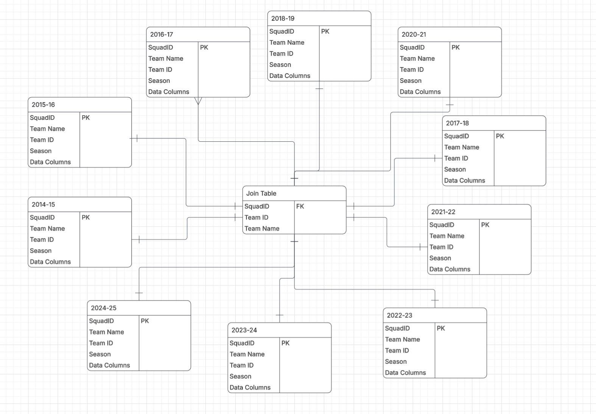

# DS 4320 Project 1: Predicting the Men's March Madness Tournament
An analysis of which NCAA Men's Basketball teams are the most successful in the championship tournament, which teams might be most likely to reach the final four and win the title in future rounds, and what teams would come out on top if they were to face each other in the tournament. The model is trained using data from various seasons and includes averages of 

Name: Teagan Britten

Computing ID: uup3cy

DOI: 

License: [MIT License](LICENSE)

### [Access the Press Release Here](pressrelease.md)
### [Access the Data Here](https://1drv.ms/f/c/6a550bae65b9bbfe/IgCLSUE3acp8SqdHENqi9fJtAUzyQvq90YjV4GNCzZ49RTw?e=XurULA)
### [Access the Data Pipeline Here](pipeline.ipynb)

## Problem Definition

### General Problem: 
Predicting sports game outcomes

### Specific Problem: 
Can we use past team and seed results, rankings, roster quality, and other performance metrics to accurately predict the winner of each game of the Men's NCAA Basketball Tournament? 

### Rationale
Sports games, by nature but also with time, involve a significant amount of data that can be analysed to understand how a team performed and why one team outperformed the other. Combining these results into season-long analysis and developing sport-specific metrics for understanding which teams perform better than others provides an even better and more detailed picture of a team's success and what contributes to that. College basketball is certainly no exception to having a vast array of data available to understand it, and has a vast number of competing teams to understand and predict performance for. The NCAA tournament, or March Madness, is the ending of the season, and is one of the most unique and logistically complex sporting events in the world. It involves a variety of teams facing off against others that rarely faced each other and may not even have any common opponents that season. This makes predicting the outcomes of games in the college basketball season and specifically March Madness a difficult yet possible and valuable task to take on. 

### Motivation
Being able to accurately predict the outcome of basketball games could be very valuable to a number of parties. One of these are teams looking at their potential opponents. If a team is preparing for the NCAA tournament, in which turnaround periods between games are incredibly slim, then knowing that one team is far more likely than the other to be the next opponent could help that team decide how to weight their preparations going into that round of the tournament. Athletic departments would also be able to better plan and allocate resources if they have a good understanding of if and when a team might be playing. The organisers of the tournament can also better prepare for what accommodations are needed for specific teams, prepare to sell tickets for said teams, and advertise to fans of those teams that might want to attend their games.

### [New Predictive Model Can Predict the Most Unpredictable Tournament](pressrelease.md)

## Domain Exposition

### Table 1: Definitions

| Term | Definition |
| --- | --- |
| NET (NCAA Evaluation Tool) | An algorithmic metric used to rank all division I teams based on their performance |
| FG% | Field Goal Percentage is the proportion of made shots from the field of all attempts |
| eFG% | effective Field Goal percentage is a metric using field goal percentage to 
| Seed | Where the team is ranked 1-16 within one of four regions of the tournament |
| Bubble | The ranking area for teams that are on the edge of making the tournament, either in the 'field' or out |
| WAB | Wins Above Bubble represents the difference in the number of wins a team has compared to the expected number of wins an average "bubble" team would earn against a given teams' schedule |
| Quadrants | Games for teams are divided into four quadrants based on opponent quality and location, with Quadrant 1 games being the most difficult and Quadrant 4 wins being the least difficult |

### Paragraph:
NCAA Division I Men's Basketball features over 300 teams in 31 leagues known as conferences. Each year, the season finishes with a 68-team tournament of which the winner is declared the national champion. The winner of each league is given automatic entry into the tournament, with the remaining teams selected by a committee based on their performance across the season, referred to as their resume. The bubble includes the lowest ranked at-large teams (teams without an automatic entry) that have reasonable potential to qualify for the tournament. A bid refers to a team being invited to participate in the tournament. 

### Table 2: Domain Articles

[Link to All Articles](https://1drv.ms/f/c/6a550bae65b9bbfe/IgDpPy3oLBabSIEaHf0wTiNBAYl-XSNj_kqXjkrSQjjIEok?e=Kg92FL)

| Article Name | Summary | Link |
| --- | --- | --- |
| Probabilities of Victory in Head-to-Head Team Matchups | A detailed explanation of predicting the outcome of sports games, applied to the sport of baseball | [Access Here](https://1drv.ms/b/c/6a550bae65b9bbfe/IQCoo7Y-FsfkSbSU9fKfzrn5AUnbsLPBb3uv1CKfmNsQ8RE?e=n3E2e6) |
| March Madness bracketology: The ultimate guide | Provides an overview of how the tournament is set-up and how the bracket is formed | [Access Here](https://1drv.ms/b/c/6a550bae65b9bbfe/IQDyBeFlp3txSppLTbMxiOlgAcmxAigQh778PHsd8xpthoM?e=cF0KT3) |
| The Ultimate Guide to Predictive College Basketball Analytics | Covers a wide variety of predictive analytics and how they are calculated | [Access Here](https://1drv.ms/b/c/6a550bae65b9bbfe/IQDYfh2fnSgtQ56JZp9eK_rVAYYHyrhro7xMsMLF20wVNnw?e=UsMJJs) |
| Analytics in College Hoops: A New Type of March Madness | This article, using Michigan State as an example, covers how teams use data-driven processes to inform their decision making | [Access Here](https://1drv.ms/b/c/6a550bae65b9bbfe/IQArNTgxKjnpTIBnYVF-wygcAXn1a50hIx7ZJ1Ilwz6zxn0?e=cLjYrM) |
| The science of strength: How data analytics is transforming college basketball | MIT looks at how data impacts basketball teams beyond just predictive metrics | [Access Here](https://1drv.ms/b/c/6a550bae65b9bbfe/IQBoxziryfllQ6zidZEQHIlUAalGdfUrrLYczeK6vWCv-sY?e=FQ21A7) |

## Data Creation 

The data in this dataset was pulled from several sources hosting data from men's college basketball since 2015. One of these sources, CBBPy, functions as an API that allows calls to retrieve data on individual games, players, and season-long statistics for teams. I collected data from this API for season-long averages that include the number of points a team scores or allows per game and other information. The several functions contained in the generate_data are used to pull data from the original source and then calculate season-long averages from those columns. The other columns in the dataset are pulled from the NCAA, and include each team's NET ranking, whether they qualified for the tournament and what seed they received if they did, and how far each tournament team advanced in the tournament. 

### Files from Data Productions

| File Name | Purpose | Access | 
| --- | --- | --- |
| generate_data.ipynb | A Jupyter notebook containing functions that pull data from various sources and calculate columns for use in the machine learning process | [Access Here](generate_data.py) |
| /data | A directory containing database files, parquet files, and CSV files of the data as pulled from the multiple data sources | [Access Here](/data) | 
| pipeline.ipynb | A Jupyter notebook containing the neural network used to predict team performance in the NCAAM tournament | [Access Here](pipeline.ipynb) |

### Bias Identification

There are various sources of bias that can come into a basketball game, and differences in how teams are affected. For example, a team that plays faster will score more points per game on average than a team that plays at a slower pace, even if the slower team is more successful. Teams may also play different numbers of games during the season, which can have an effect on how many wins or losses a team has if they have more or less games. 

### Bias Mitigation

One of the important ways that bias in metrics can be mitigated is by using a wide number of metrics and objective measures to train the model. Using 10 or more columns, as there are present in this dataset, will help to reduce the variability and mean that significant weight is not placed on individual metrics or features in the dataset. Extra care will have to be paid to the weights of the model, especially if regularization methods are used, to ensure that biased features are not overweighted in the dataset to cause elements of bias to creep into the results or for one metric to decide the results. 

### Rationale 

The decision-making rationale in regards to model weights will be to lean towards including metrics over shrinking them dramatically or all the way towards zero. Additionally, data formatting decisions will be made to fit the intent of the statistic as much as possible. What this means is that any changes to the datatype, format, or any other data cleaning processes will be taken with regards to both the standard format for that widely-recognized and used statistic and to what makes most sense functionally for the analysis.

## Metadata

### Entity Relationship Diagram 

### 

### Data Tables

| Table Name | Brief Description | CSV Link |
| --- | --- | --- |
| team_season_stats | Main modeling table with one row per team-season and all engineered features/targets | [Access](https://1drv.ms/u/c/6a550bae65b9bbfe/IQC26J6jS176TKCYqcZ6HjjZAac9HyCB82WZZWmGXeBY99k?e=3Xj3ns) |
| net_rankings | Team NET ranking by season and team key | [Access](https://1drv.ms/u/c/6a550bae65b9bbfe/IQBFwl6tBfsYQJhYG-siau0XAUidE__fA7qdvdCi6_ZF5W8?e=raNee9) |
| ncaa_tournament_results | Tournament participation, seed, and finish round by season/team | [Access](https://1drv.ms/u/c/6a550bae65b9bbfe/IQBC7t7QpSppTbw_FC0pD-KEAS0iiekT2uaaoI1JBsU7O0o?e=o0450j) |
| join_table | Lookup table linking SquadID, TeamKey, Team, and Season | [Access](https://1drv.ms/u/c/6a550bae65b9bbfe/IQDT7yAMadOLRq-55TlsLK5lAeUJJkw46LABm_R5mZ179ZA?e=17UV3h) |
| season_2014_15 | Season-specific subset of team season stats for 2014-15 | [Access](https://1drv.ms/u/c/6a550bae65b9bbfe/IQDazdZtkdptSprzpYqJrMQJAS_I5QqPrVKB2biD9AgJWhw?e=XtICdC) |
| season_2015_16 | Season-specific subset of team season stats for 2015-16 | [Access](https://1drv.ms/u/c/6a550bae65b9bbfe/IQCEu6o6cMSgQZLUjaj70YFPAYQNjcqfh6CnvZJ16fcTy8w?e=fpJTai) |
| season_2016_17 | Season-specific subset of team season stats for 2016-17 | [Access](https://1drv.ms/u/c/6a550bae65b9bbfe/IQAhU1tzj4BBQZ0-AdjZIv_uAT8O-TC4zgco-ZmvLrIOPz0?e=cTxH3Q) |
| season_2017_18 | Season-specific subset of team season stats for 2017-18 | [Access](https://1drv.ms/u/c/6a550bae65b9bbfe/IQCiBnigQzbOQKh0wE8BGH2_AfY8tX7_I3oW4yH2XuPqcYI?e=9yjC6d) |
| season_2018_19 | Season-specific subset of team season stats for 2018-19 | [Access](https://1drv.ms/u/c/6a550bae65b9bbfe/IQB7YieRDPJgRq1K47CELYxQAeiXGmJPFcdKaN3iFMo2qjg?e=hm5TvZ) |
| season_2020_21 | Season-specific subset of team season stats for 2020-21 | [Access](https://1drv.ms/u/c/6a550bae65b9bbfe/IQAMI3PwDt3URZQK-EidSCnkAVgP-g2InhuW8RPiVKOQ4EA?e=AFt8Vl) |
| season_2021_22 | Season-specific subset of team season stats for 2021-22 | [Access](https://1drv.ms/u/c/6a550bae65b9bbfe/IQCa4kvBgNLPSL-XAhNwytI8AemhfjQt2qEGSvfkBeZOJFM?e=WhnifV) |
| season_2022_23 | Season-specific subset of team season stats for 2022-23 | [Access](https://1drv.ms/u/c/6a550bae65b9bbfe/IQAFfMV8X3NhSrYICNLsIiuwAfxqy7Ni9iTAHecfhtewDII?e=GFioz0) |
| season_2023_24 | Season-specific subset of team season stats for 2023-24 | [Access](https://1drv.ms/u/c/6a550bae65b9bbfe/IQBjXY-tKkP5Tq0lAxQpnFZ7AYTPq4vrNd5yIVzzwDrT1FM?e=cCfKjb) |
| season_2024_25 | Season-specific subset of team season stats for 2024-25 | [Access](https://1drv.ms/u/c/6a550bae65b9bbfe/IQCD6-m1ytenRIC_8HLEfLL-AQrhNcbzzVYlEzAyAfTy-Nc?e=CQF4DL) |

### Data Dictionary (team_season_stats)

#### Numerical uncertainty for this dataset is zero for all columns, as measurements of made baskets or wins are without epistemic or aleatoric uncertainty 

| Feature Name | Data Type | Description | Example | Numerical Uncertainty |
| --- | --- | --- | --- | --- |
| SquadID | string | Stable primary key built from season and team key | 2024-25_connecticut | N/A |
| Team | string | Team display name | Connecticut | N/A |
| TeamKey | string | Normalized team name key used for joins | connecticut | N/A |
| Season | string | Season label | 2024-25 | N/A |
| Wins | integer | Total season wins | 31 | 0 |
| Losses | integer | Total season losses | 3 | 0 |
| Games | integer | Total games played | 34 | 0 |
| SRS | float | Simple Rating System value | 22.41 | 0 |
| SOS | float | Strength of schedule | 9.80 | 0 |
| ConfWins | integer | Conference wins | 18 | 0 |
| ConfLosses | integer | Conference losses | 2 | 0 |
| HomeWins | integer | Home wins | 16 | 0 |
| HomeLosses | integer | Home losses | 1 | 0 |
| AwayWins | integer | Away wins | 10 | 0 |
| AwayLosses | integer | Away losses | 2 | 0 |
| PointsForTotal | float | Total points scored in season | 2754 | 0 |
| PointsAgainstTotal | float | Total points allowed in season | 2310 | 0 |
| AvgPointsFor | float | Average points scored per game | 81.0 | 0 |
| AvgPointsAgainst | float | Average points allowed per game | 67.9 | 0 |
| WinPct | float | Win percentage | 0.912 | 0 |
| TotalsMP | float | Total minutes played | 6800 | 0 |
| TotalsFG | float | Total field goals made | 1020 | 0 |
| TotalsFGA | float | Total field goal attempts | 2105 | 0 |
| TotalsFGPct | float | Field goal percentage | 0.485 | 0 |
| Totals3P | float | Total three-pointers made | 280 | 0 |
| Totals3PA | float | Total three-point attempts | 760 | 0 |
| Totals3PPct | float | Three-point percentage | 0.368 | 0 |
| TotalsFT | float | Total free throws made | 434 | 0 |
| TotalsFTA | float | Total free throw attempts | 560 | 0 |
| TotalsFTPct | float | Free throw percentage | 0.775 | 0 |
| TotalsORB | float | Total offensive rebounds | 380 | 0 |
| TotalsTRB | float | Total rebounds | 1220 | 0 |
| TotalsAST | float | Total assists | 610 | 0 |
| TotalsSTL | float | Total steals | 250 | 0 |
| TotalsBLK | float | Total blocks | 145 | 0 |
| TotalsTOV | float | Total turnovers | 390 | 0 |
| TotalsPF | float | Total personal fouls | 520 | 0 |
| HomeGames | float | Total home games | 17 | 0 |
| AvgPTS_Box | float | Box-score derived points per game | 81.0 | 0 |
| AvgREB_Box | float | Box-score derived rebounds per game | 35.9 | 0 |
| AvgAST_Box | float | Box-score derived assists per game | 17.9 | 0 |
| NETRank | float | NCAA NET ranking for team-season | 6 | 0 |
| MadeNCAATournament | boolean | Whether team made NCAA tournament | True | N/A |
| TournamentSeed | integer | Tournament seed (if qualified) | 1 | 0 |
| TournamentFinishRound | string | Furthest round reached in NCAA tournament | Final Four | N/A |
 

